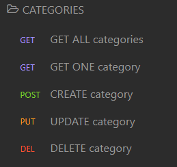
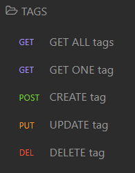

# E-commerce Back End

## Table of Contents
  * [Description](#description)
  * [Installation/Usage](#installation/usage)
  * [Usage](#usage)
  * [Technology](#technology)
  * [Contribution](#contribute)
  * [Questions](#questions)

## Description
The back-end for an e-commerce site. Allows the user/company to create a database and track the inventory of items in stock using JSON objects(GET, POST, PUT, DELETE).

To see how the application works, click [HERE](https://drive.google.com/file/d/1TPgRP6tbJFzO1wKOb6TW88kv5ZhnMI1c/view) for a demo video.

## Installation/Usage
1. Clone the repo locally.
2. Run `npm install`
3. Run `mysql -u root -p`
4. Run `source db/schema.sql`, then `exit`
5. Run `npm run seed`
6. Lastly, run `npm start`

## Technology
  * MySQL2
  * Sequelize
  * JavaScript
  * Node.js
  * Express.js
  * dotenv

## Contribution
No other contributors at the moment. If you'd like to contribute, feel free to contact me.

## Questions
Have any questions? Please feel free to reach out!  
GitHub: https://github.com/ValPal1320  
Email: valgonzalez13@yahoo.com